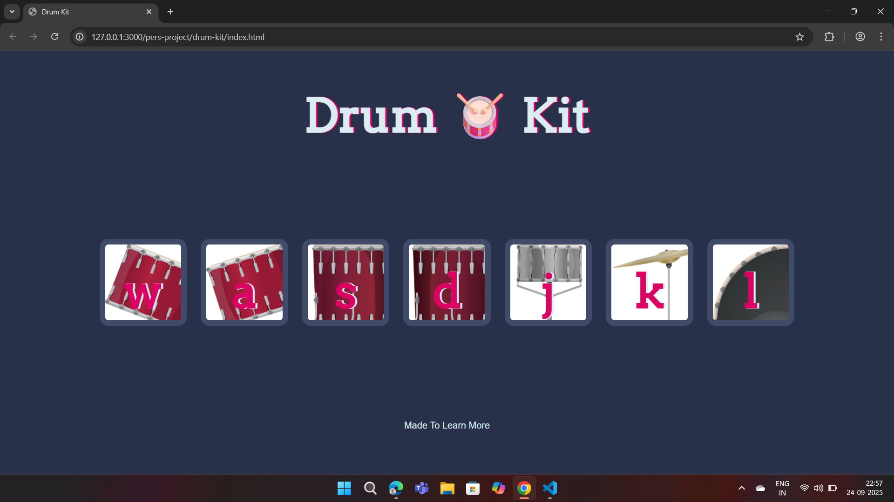

# 🥁 Drum Kit Website  

An interactive **drum kit web app** built with **HTML, CSS, and JavaScript**.  
Users can play different drum sounds by either clicking on buttons or pressing specific keys on their keyboard.  

🎶 Perfect for learning **DOM manipulation, event handling, and audio APIs** in JavaScript.  

---

## 🚀 Live Demo  
👉 [Click here to play the Drum Kit](https://mohamednoordeen22.github.io/drum-kit/)  

---

## 📸 Preview  
<!-- (Add a screenshot of your project here after hosting. Example below:)   -->
  

---

## ✨ Features  
- Play drums using **keyboard keys (`w, a, s, d, j, k, l`)**  
- Play drums by **clicking on drum buttons**  
- **Animated button effect** when pressed  
- Built with **pure HTML, CSS, and JavaScript** (no frameworks)  

---

## 🛠️ Tech Stack  
- **HTML5** – Structure  
- **CSS3** – Styling & animations  
- **JavaScript (ES6)** – DOM manipulation, event handling, audio  

---

## 📂 Project Structure  
drum-kit/
│── index.html # Main HTML file
│── styles.css # CSS styles
│── index.js # JavaScript logic
│── sounds/ # Drum sound files
│── images/ # Drum button images
└── README.md # Project documentation


---

## 📂 How to Run Locally
```bash
git clone https://github.com/mohamednoordeen22/drum-kit.git
cd drum-kit
open index.html